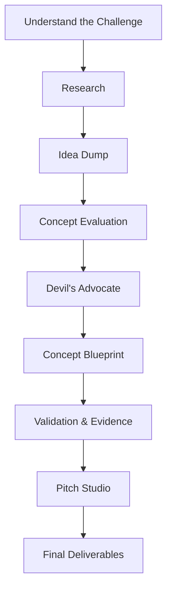

# Project Roadmap

This vault follows a single pipeline. Each stage is self‑contained and has the same structure:

1. **Purpose** – why this stage exists.
2. **Inputs** – what you should have before starting.
3. **Process** – what happens here.
4. **Outputs** – what you produce.
5. **Files** – the specific notes and tools for this stage.
6. **Next Stage** – where to go next.

## Stage Overview

| Stage | Purpose |
|:------|:--------|
| [[01 - Understand the Challenge]] | Grasp the competition rules, team agreements, and evaluation criteria. |
| [[02 - Research]] | Build a factual foundation with data, papers, and reports. |
| [[03 - Idea Dump]] | Generate a large pool of concepts without judgment. |
| [[04 - Concept Evaluation]] | Objectively compare concepts to select the strongest. |
| [[05 - Devil's Advocate]] | Stress‑test the best idea until it's bulletproof. |
| [[06 - Concept Blueprint]] | Define the complete solution in a master document. |
| [[07 - Validation & Evidence]] | Prove every claim with citations and real‑world data. |
| [[08 - Pitch Studio]] | Turn the solution into a compelling presentation. |
| [[09 - Final Deliverables]] | Polish and submit the final materials. |

Begin your journey: [[01 - Understand the Challenge]]

---

← [[00_Home]] | ↑ [[00_Home]]
