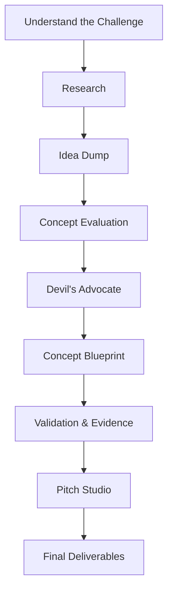

# Project Roadmap

This vault follows a single pipeline. Each stage is self‑contained and has the same structure:

1. **Purpose** – why this stage exists.
2. **Inputs** – what you should have before starting.
3. **Process** – what happens here.
4. **Outputs** – what you produce.
5. **Files** – the specific notes and tools for this stage.
6. **Next Stage** – where to go next.

## Stage Overview

| Stage | Mode | Purpose | Team Sync |
|:------|:-----|:--------|:----------|
| [[01 - Understand the Challenge]] | 🧑‍💻 Individual | Grasp rules, agreements, and evaluation criteria. | Align as team |
| [[02 - Research]] | 🧑‍💻 Individual | Build a factual foundation with data, papers, and reports. | Share findings |
| [[03 - Idea Dump]] | 🧑‍💻 Individual | Generate a large pool of concepts. | Pool & discuss |
| [[04 - Concept Evaluation]] | 👥 Team | Compare concepts objectively; vote on the winner. | — |
| [[05 - Devil's Advocate]] | 👥 Team | Stress‑test the best idea until bulletproof. | — |
| [[06 - Concept Blueprint]] | 🧑‍💻 Individual | Define the solution per module. | Merge into master doc |
| [[07 - Validation & Evidence]] | 🧑‍💻 Individual | Prove every claim with citations and data. | Cross-check findings |
| [[08 - Pitch Studio]] | 👥 Team | Build the presentation story together. | — |
| [[09 - Final Deliverables]] | 👥 Team | Polish, final review, and submit. | —

> **Sync rhythm:** Team meets after stages **01, 02, 03, 06, 07** to connect individual work before moving to the next team phase.

Begin your journey: [[01 - Understand the Challenge]]

---

← [[Home]] | ↑ [[Home]]
