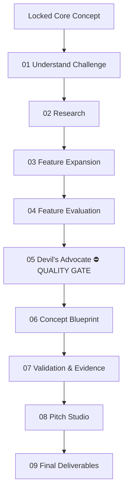

# Project Roadmap

This vault follows a single pipeline. Each stage is self‑contained and has the same structure:

1. **Purpose** – why this stage exists.
2. **Inputs** – what you should have before starting.
3. **Process** – what happens here.
4. **Outputs** – what you produce.
5. **Files** – the specific notes and tools for this stage.
6. **Next Stage** – where to go next.

## Stage Overview

| Stage | Mode | Purpose | Team Sync |
|:------|:-----|:--------|:----------|
| [[01 Understand Challenge/What Is This For|01 Understand Challenge]] | Individual | Understand the brief and map the locked concept against it — identify gaps enrichment must fill. | Align as team |
| [[02 Research/What Is This For|02 Research]] | Individual | Targeted research within the locked concept's topic area. | Share findings |
| [[03 Feature Expansion/What Is This For|03 Feature Expansion]] | Individual | Diverge on features around the locked concept. | Pool & discuss |
| [[04 Feature Evaluation/What Is This For|04 Feature Evaluation]] | Team | Score and select features (never the concept — concept is locked). | — |
| [[05 Devils Advocate/What Is This For|05 Devil's Advocate]] | Team | Critical quality gate — find every flaw a judge could find and mitigate it. | — |
| [[06 Concept Blueprint/What Is This For|06 Concept Blueprint]] | Individual | Assemble locked concept + surviving features into complete design. | Merge into master doc |
| [[07 Validation Evidence/What Is This For|07 Validation & Evidence]] | Individual | Prove every claim of the enriched locked concept. | Cross-check findings |
| [[08 Pitch Studio/What Is This For|08 Pitch Studio]] | Team | Build the presentation story. | — |
| [[09 Final Deliverables/What Is This For|09 Final Deliverables]] | Team | Polish, final review, and submit. | — |

> **Sync rhythm:** Team meets after stages **01, 02, 03, 06, 07** to connect individual work before moving to the next team phase.

Begin your journey: [[01 Understand Challenge/What Is This For|01 Understand Challenge]]

---

← [[_Home]] | ↑ [[_Home]]
